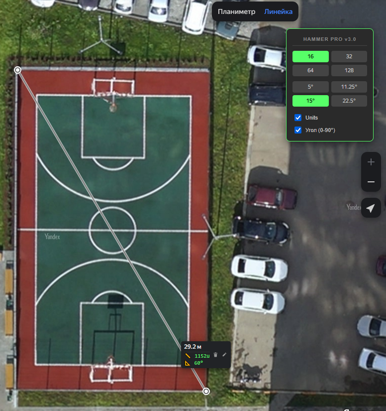

# Yandex Maps to Hammer Units PRO v3.0

Профессиональный инструмент для картографов и левел-дизайнеров (Source 2 / Hammer Engine). Скрипт автоматически рассчитывает расстояния на Яндекс Картах, конвертирует их в юниты и вычисляет углы наклона с привязкой к сетке.

## 🚀 Основные возможности
- **Конвертация в Юниты**: Авто-расчет прямо в баблах линейки (1 метр ≈ 39.37 units).
- **Выбор сетки (Grid Snap)**: Быстрое переключение между 16, 32, 64 и 128 юнитами.
- **Умный угол (0-90°)**: Расчет угла наклона последнего сегмента относительно горизонтали — идеально для точного переноса дорог и зданий.
- **Интерактивное меню**: 
  - **Movable UI**: Перетаскивайте панель за заголовок в любое место.
  - **Toggles**: Включайте/выключайте отображение юнитов или углов на лету.
- **Стабильность**: Использование `DOMMatrix` для точного считывания координат даже при обновлении движка карт.

## 🆕 Что нового в v3.0
- Добавлен расчет углов с настраиваемым шагом (5°, 15° и др.).
- Добавлены чекбоксы для управления отображением данных.
- Исправлен парсинг расстояний с пробелами (например, "1 234 м").
- Полностью переписан механизм Drag & Drop для плавности.

## 🛠 Установка

1. Установите расширение [Tampermonkey](https://www.tampermonkey.net/) для вашего браузера.
2. **[Кликните сюда для автоматической установки](https://github.com/postal1443/yandex-maps-to-hammer-units/raw/refs/heads/main/yandex_hammer_pro.user.js)** 🚀
3. В открывшейся вкладке Tampermonkey нажмите кнопку **"Установить"** (Install) или **"Обновить"**.
4. Откройте [Яндекс Карты](https://yandex.ru/maps/), выберите инструмент "Линейка" и пользуйтесь!

---
> **Note**  
> Проект разработан и оптимизирован при участии ИИ (Gemini). Это позволило внедрить сложную математику углов и добиться стабильной работы с динамическим DOM Яндекс Карт.
