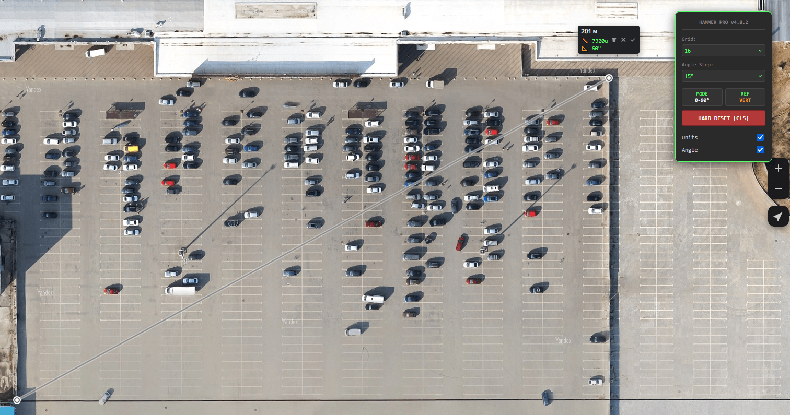

# Yandex Maps to Hammer Units PRO

Инструмент для картографов и левел-дизайнеров Source 2 (Hammer Engine). Скрипт автоматически рассчитывает расстояние на Яндекс Картах и конвертирует его в юниты Hammer с привязкой к сетке (Grid Snap).

## 🚀 Основные возможности
- **Авто-расчет**: Добавляет значение в юнитах прямо в баблы линейки Яндекс Карт.
- **Выбор сетки**: Настраиваемая панель управления (16, 32, 64, 128 юнитов).
- **Movable UI**: Перетаскиваемое меню управления, которое можно разместить в удобном месте экрана.
- **Адаптивность**: Корректно работает с метрами и километрами.

## 🛠 Установка
1. Установите расширение [Tampermonkey](https://www.tampermonkey.net/) для вашего браузера.
2. Создайте новый скрипт.
3. Скопируйте содержимое файла `yandex_hammer_pro.user.js` из этого репозитория.
4. Сохраните (Ctrl+S) и обновите страницу Яндекс Карт.

## ⚙️ Формула расчета
Используется стандартное соотношение для Source 2:
`1 метр ≈ 39.37 units`

---
> **Note**
> Данный инструмент был спроектирован и оптимизирован при поддержке ИИ (Gemini). Это позволило добиться высокой адаптивности интерфейса и стабильной работы с динамическим DOM Яндекс Карт.
